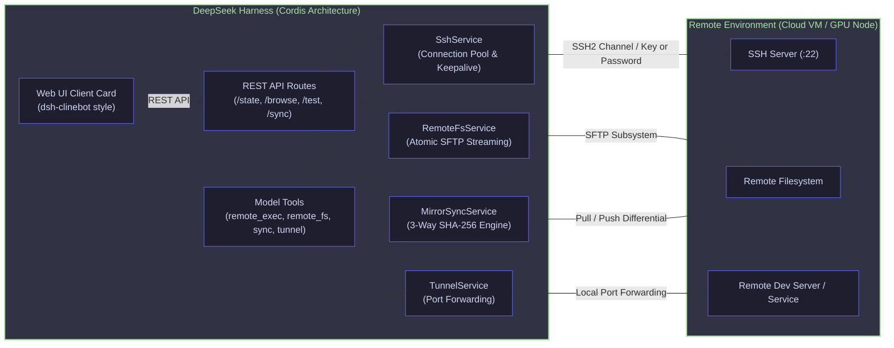

# 📦 @goodandready/dsh-remote-workspace

<div align="center">

<h3>Enterprise Remote Workspace for DeepSeek Harness: SSH, SFTP File Sync & Tunneling</h3>

<p align="center">
  <a href="https://www.npmjs.com/package/@goodandready/dsh-remote-workspace"></a>
  <a href="LICENSE"></a>
  <a href="https://github.com/topics/dsh-plugin"></a>
  <a href="https://nodejs.org"></a>
</p>

<!-- Author Showcase Badge -->
<p align="center">
  <a href="https://goodandready.app/"></a>
</p>

<p align="center">
  <a href="README.md"><b>🇬🇧 English</b></a> •
  <a href="README.ru.md"><b>🇷🇺 Русский</b></a> •
  <a href="README.zh.md"><b>🇨🇳 中文说明</b></a>
</p>

<table align="center">
  <tr>
    <td align="center">
      ⭐ <strong>If you like this plugin, please star it on GitHub</strong> — it shows me that the plugin is useful to you and motivates me to keep developing it.
      <br><br>
      🐛 <strong>If you find a bug or would like to request a feature</strong>, open a GitHub issue in any language — I will review your proposal and implement useful suggestions in a future plugin version.
    </td>
  </tr>
</table>

</div>

---

## ⚡ Overview & The Problem

In modern software engineering and agentic workflows, AI agents orchestrating code within **DeepSeek Harness (DSH)** frequently need to work across remote environments: cloud virtual machines, high-performance GPU instances, containerized remote clusters, and staging servers.

Without `@goodandready/dsh-remote-workspace`, developers face critical roadblocks:
1. **Local Boundary Limitation**: Standard DSH operations and agent tools run exclusively against the local machine where DSH is deployed.
2. **Fragile Ad-Hoc Scripts**: Manual SSH wrappers and ad-hoc SCP uploads lack robust connection pooling, causing connection drops, hangs under network latency, and high resource overhead.
3. **Silent File Overwrites**: Naive file copies risk corrupting data during network interruptions or overwriting concurrent modifications made by remote teams.
4. **Port Accessibility**: Accessing remote web servers, inference APIs, or debuggers typically requires manual external SSH tunneling configuration.

`@goodandready/dsh-remote-workspace` solves these challenges directly within the Cordis framework. It provides an enterprise-grade remote development subsystem with persistent SSH2 connection pooling, atomic SFTP file operations, conflict-aware 3-way synchronization, dynamic port tunneling, and an interactive Web UI settings card styled after `dsh-clinebot`.

---

## 🏗️ Architecture



---

## ✨ Full Feature Breakdown

### 1. `SshService` — High-Performance Connection Pool & Authentication
- **Connection Pooling**: Maintains reusable, authenticated SSH2 client sessions keyed by `host:port:username`.
- **Dual Authentication Modes**:
  - **SSH Private Key**: Path to local key (`~/.ssh/id_ed25519`), raw PEM string, and optional passphrase decryption.
  - **Password Authentication**: Direct secure password authentication.
- **Diagnostic Health Probing**: Built-in `testConnection` executes latency measurements (ping in milliseconds) and detects remote OS architecture (`uname -srm`).
- **Resilience**: Heartbeat keep-alive packets prevent timeout disconnects from aggressive firewalls.

### 2. `RemoteFsService` — Resilient SFTP Operations
- **Atomic File Writing**: Writes content to an ephemeral temporary file (`.tmp.<timestamp>.<hash>`) and renames it atomically upon complete upload, preventing partial or corrupted files.
- **Streaming Reads**: High-speed chunked stream reader supporting large files with selectable encoding.
- **Filesystem Primitives**: Provides `stat`, `listDir`, recursive `mkdir` (like `mkdir -p`), and recursive `remove` directly over the SFTP subsystem.

### 3. `MirrorSyncService` — Conflict-Aware 3-Way Synchronization
- **State Manifest Tracking**: Maintains baseline SHA-256 hash digests in `.dsh-sync-manifest.json` for all tracked files.
- **Conflict Prevention**: Detects when both local and remote files have diverged since the last synchronization baseline, halting operations with a detailed conflict report rather than silently overwriting changes.
- **Selective Sync**: Supports directional `pull` (remote → local) and `push` (local → remote) with optional `force` override.
- **Dry-Run Inspection**: Allows agents or developers to preview affected files, additions, modifications, and deletions before applying changes.
- **Smart Exclusion**: Built-in default ignore patterns for version control, dependencies, and temporary files (`.git`, `node_modules`, `.dsh`, `.worktrees`, `.DS_Store`).

### 4. `TunnelService` — Integrated SSH Port Forwarding
- **Local Port Forwarding**: Binds a local port on the DSH host and securely forwards all incoming TCP traffic over the encrypted SSH channel to any target port on the remote host (e.g. `127.0.0.1:8080` → remote `127.0.0.1:8080`).
- **Dynamic Lifecycle**: Start, stop, and enumerate active tunnels programmatically or via UI.

### 5. `tools.js` — Ergonomic Agent Tools
Four orthogonal, high-leverage tools exposed directly to LLM agents:
- `remote_exec`: Execute shell commands on the remote workspace with custom working directory and exit code capture.
- `remote_fs`: Read, write, inspect, list, create directories, or delete files on the remote filesystem.
- `remote_sync`: Synchronize files between the local mirror and remote server with conflict awareness and dry-run mode.
- `remote_tunnel`: Start, stop, or list SSH port-forwarding tunnels.

### 6. `client.js` — Native DSH Settings Card UI
- Designed strictly to DSH UX guidelines and styled after `dsh-clinebot`.
- **Segmented Auth Switcher**: Clean tabbed toggle between Private Key and Password authentication.
- **Remote Directory Browser Modal**: Interactive remote file browser with breadcrumb navigation and one-click path selection.
- **Connection Diagnostic Badge**: Real-time ping testing with visual latency indicators and remote OS display.
- **Action Triggers**: Quick buttons for directional synchronization and tunnel monitoring.

---

## 📦 Installation

Install into your DSH `web` profile:

```bash
dsh plugin --profile web add @goodandready/dsh-remote-workspace
```

Or install using the DSH CLI:

```bash
dsh plugin add @goodandready/dsh-remote-workspace
```

---

## ⚙️ Configuration Reference

Configuration can be managed either via the Web UI Settings card or defined in your DSH configuration files (`settings.yaml` / Cordis config):

```yaml
dsh-remote-workspace:
  activeProfileId: "prod-cloud-gpu"
  profiles:
    - id: "prod-cloud-gpu"
      name: "Cloud GPU VM"
      host: "remote.example.com"
      port: 22
      username: "deploy"
      authType: "key"              # "key" or "password"
      privateKeyPath: "/home/user/.ssh/id_ed25519"
      passphrase: ""
      password: ""
      remoteWorkspace: "/var/www/my-project"
      localMirrorPath: "/home/user/projects/my-project"
```

### Parameters Table

| Parameter | Type | Default | Description |
|---|---|---|---|
| `profiles` | `Array<Profile>` | `[]` | List of configured remote server profiles. |
| `activeProfileId` | `string` | `""` | ID of the currently active remote host profile. |
| `profile.id` | `string` | `""` | Unique identifier for the profile. |
| `profile.name` | `string` | `""` | Human-readable label displayed in UI. |
| `profile.host` | `string` | `""` | Hostname, FQDN, or IP address of the remote host. |
| `profile.port` | `number` | `22` | Remote SSH port. |
| `profile.username` | `string` | `""` | SSH login username. |
| `profile.authType` | `string` | `"key"` | Authentication method: `"key"` or `"password"`. |
| `profile.privateKeyPath`| `string` | `""` | Path to local OpenSSH private key file. |
| `profile.privateKey` | `string` | `""` | Raw PEM/OpenSSH private key content (alternative to path). |
| `profile.passphrase` | `string` | `""` | Passphrase for encrypted private keys. |
| `profile.password` | `string` | `""` | Password for password-based authentication. |
| `profile.remoteWorkspace` | `string` | `""` | Base directory of the project on the remote machine. |
| `profile.localMirrorPath` | `string` | `""` | Local directory for mirror synchronization. |

---

## 🔌 Model Tools Reference

### `remote_exec`
Executes a bash or shell command on the active remote host.
- **Parameters**:
  - `command` (`string`, required): Shell command line to execute.
  - `cwd` (`string`, optional): Working directory on remote host. Defaults to `remoteWorkspace`.
- **Returns**: `{ exitCode: number, stdout: string, stderr: string }`

### `remote_fs`
Performs filesystem operations over SFTP.
- **Parameters**:
  - `action` (`string`, required): One of `"read"`, `"write"`, `"stat"`, `"list"`, `"mkdir"`, `"remove"`.
  - `path` (`string`, required): Target remote path (absolute or relative to workspace).
  - `content` (`string`, optional): Required for `"write"` action.
  - `recursive` (`boolean`, optional): Recursive flag for `"remove"` action.
- **Returns**: Result object depending on action (`{ content }`, `{ stat }`, `{ entries }`, `{ ok: true }`).

### `remote_sync`
Runs 3-way conflict-aware synchronization between local and remote directories.
- **Parameters**:
  - `direction` (`string`, required): `"pull"` (remote → local) or `"push"` (local → remote).
  - `force` (`boolean`, optional): Overwrite conflicts if true.
  - `dryRun` (`boolean`, optional): Simulate changes without writing to disk.
- **Returns**: Sync summary object with applied actions, changed files, and any detected conflicts.

### `remote_tunnel`
Manages SSH local port forwarding tunnels.
- **Parameters**:
  - `action` (`string`, required): `"start"`, `"stop"`, or `"list"`.
  - `localPort` (`number`, optional): Local port to bind (for `"start"`).
  - `remotePort` (`number`, optional): Remote destination port (for `"start"`).
  - `tunnelId` (`string`, optional): Identifier of the tunnel to terminate (for `"stop"`).
- **Returns**: `{ tunnelId, localPort, remotePort }` or `{ tunnels: [...] }` or `{ success: boolean }`.

---

## 🌐 HTTP API Routes Reference

All endpoints are hosted under `/dsh-remote-workspace`:

| Method | Route | Description | Request Body |
|---|---|---|---|
| `GET` | `/dsh-remote-workspace/state` | Returns profiles, active profile ID, and active tunnels. | — |
| `POST` | `/dsh-remote-workspace/profiles/save` | Create or update a profile. | Profile JSON object |
| `POST` | `/dsh-remote-workspace/profiles/delete` | Delete a profile by ID. | `{ id: string }` |
| `POST` | `/dsh-remote-workspace/profiles/active` | Set active profile. | `{ id: string }` |
| `POST` | `/dsh-remote-workspace/test` | Test SSH connectivity and latency. | Profile JSON object |
| `POST` | `/dsh-remote-workspace/browse` | List directory contents for remote browser modal. | `{ profile: object, path: string }` |
| `POST` | `/dsh-remote-workspace/sync` | Trigger manual pull or push synchronization. | `{ direction: "pull" \| "push", dryRun?: boolean, force?: boolean }` |

---

## 📄 License

MIT © [GooDAnDReaDY](https://github.com/GooDAnDReaDY)
