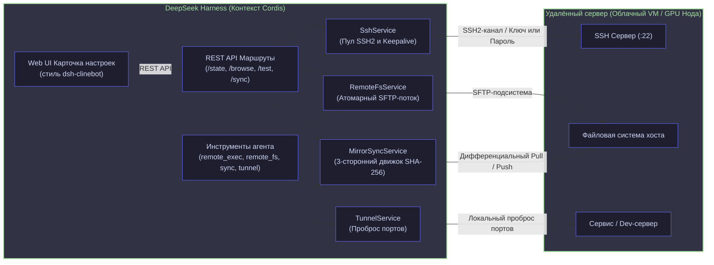

# 📦 @goodandready/dsh-remote-workspace

<div align="center">

<h3>Корпоративный плагин удалённой разработки для DeepSeek Harness: SSH, SFTP-синхронизация и туннелирование</h3>

<p align="center">
  <a href="https://www.npmjs.com/package/@goodandready/dsh-remote-workspace"></a>
  <a href="LICENSE"></a>
  <a href="https://github.com/topics/dsh-plugin"></a>
  <a href="https://nodejs.org"></a>
</p>

<!-- Обязательная кнопка перехода на витрину всех проектов -->
<p align="center">
  <a href="https://goodandready.app/"></a>
</p>

<p align="center">
  <a href="README.md"><b>🇬🇧 English</b></a> •
  <a href="README.ru.md"><b>🇷🇺 Русский</b></a> •
  <a href="README.zh.md"><b>🇨🇳 中文说明</b></a>
</p>

<table align="center">
  <tr>
    <td align="center">
      ⭐ <strong>Если вам нравится этот плагин, поставьте ему звезду на GitHub</strong> — это покажет мне, что плагин вам полезен, и будет мотивировать меня развивать его дальше.
      <br><br>
      🐛 <strong>Если вы нашли баг или хотите предложить новый функционал</strong>, создайте issue на GitHub на любом языке — я рассмотрю ваше предложение и реализую полезные идеи в одной из следующих версий плагина.
    </td>
  </tr>
</table>

</div>

---

## ⚡ Обзор и решаемая проблема

В современной программной инженерии и агентных сценариях автономные AI-агенты платформы **DeepSeek Harness (DSH)** регулярно сталкиваются с необходимостью вести разработку на удалённых серверах: мощных GPU-нодах, облачных виртуальных машинах, staging-контурах и контейнерных кластерах.

Без плагина `@goodandready/dsh-remote-workspace` возникают фундаментальные ограничения:
1. **Замкнутость на локальной машине**: Все стандартные операции DSH и инструменты агента исполняются строго локально, там где физически запущен процесс DSH.
2. **Ненадёжность самодельных скриптов**: Прямой вызов SSH/SCP через системные утилиты не имеет пула соединений, рвёт сессии при задержках сети и создаёт избыточный оверхед на постоянные рукопожатия.
3. **Риск затирания кода и повреждения файлов**: Обычное копирование файлов поверх существующих не отслеживает одновременные изменения и может повредить файл при разрыве соединения в момент записи.
4. **Изолированность портов**: Чтобы получить доступ к удалённому веб-серверу, базе данных или тестовому сервису, разработчику приходится вручную настраивать сторонние SSH-туннели.

`@goodandready/dsh-remote-workspace` решает эти задачи на уровне экосистемы Cordis: он добавляет высокопроизводительный пул соединений SSH2, потоковую работу с SFTP с атомарной защитой записи, 3-стороннюю синхронизацию с контролем конфликтов по SHA-256, динамический проброс портов и нативную карточку настроек в Web UI в стиле `dsh-clinebot`.

---

## 🏗️ Архитектура



---

## ✨ Исчерпывающий разбор возможностей

### 1. `SshService` — Пул соединений и универсальная аутентификация
- **Пул соединений**: Поддерживает постоянные авторизованные сессии SSH2, индексированные по `host:port:username`.
- **Два метода аутентификации**:
  - **SSH-ключ (Private Key)**: Поддержка путей к локальным файлам (`~/.ssh/id_ed25519`), прямых PEM-строк и парольных фраз (passphrase).
  - **Пароль (Password)**: Прямая безопасная аутентификация по логину и паролю.
- **Диагностический зонд**: Метод `testConnection` измеряет пинг в миллисекундах и определяет платформу удалённого хоста (`uname -srm`).
- **Защита от таймаутов**: Пакеты keep-alive предотвращают разрыв соединения корпоративными фаерволами.

### 2. `RemoteFsService` — Отказоустойчивый SFTP
- **Атомарная запись файлов**: Загрузка производится во временный файл (`.tmp.<timestamp>.<hash>`) с последующим атомарным переименованием. Разрыв соединения не повреждает целевой файл.
- **Потоковое чтение**: Высокоскоростное чтение фрагментами без переполнения оперативной памяти.
- **Файловые операции**: Полный набор примитивов: `stat`, `listDir`, рекурсивное создание каталогов `mkdir -p` и рекурсивное удаление `remove`.

### 3. `MirrorSyncService` — 3-сторонняя синхронизация с контролем конфликтов
- **Учёт контрольных сумм**: Сохраняет базовые слепки SHA-256 в файле `.dsh-sync-manifest.json`.
- **Обнаружение конфликтов**: Если файл изменился одновременно и на удалённом сервере, и в локальном зеркале с момента последней синхронизации, операция останавливается с подробным отчётом о конфликте.
- **Направленная синхронизация**: Поддерживает режимы `pull` (сервер → локально) и `push` (локально → сервер) с флагом принудительной перезаписи `force`.
- **Предпросмотр (Dry-Run)**: Возможность оценить состав изменяемых, добавляемых и удаляемых файлов до реального применения.
- **Умная фильтрация**: Игнорирование служебных каталогов и артефактов сборки (`.git`, `node_modules`, `.dsh`, `.worktrees`, `.DS_Store`).

### 4. `TunnelService` — Встроенные SSH-туннели
- **Прямой проброс портов (Local Port Forwarding)**: Открывает локальный порт на машине с DSH и перенаправляет трафик через защищённый SSH-туннель к любому порту на удалённой машине (например, `127.0.0.1:8080` → удалённый `127.0.0.1:8080`).
- **Управление жизненным циклом**: Программный запуск, остановка и получение списка активных туннелей.

### 5. `tools.js` — Инструменты для AI-моделей
4 чётких ортогональных инструмента для агента:
- `remote_exec`: Выполнение bash-команд на удалённом сервере с фиксацией кода возврата, stdout и stderr.
- `remote_fs`: Операции чтения, записи, stat, листинга, создания директорий и удаления.
- `remote_sync`: Синхронизация между локальным зеркалом и сервером с отчётом о конфликтах и режимом dry-run.
- `remote_tunnel`: Управление SSH-туннелями (запуск, остановка, список).

### 6. `client.js` — Нативный UI карточки настроек
- Полноценная интеграция в слот `settings.plugin.item` с ключом `dsh-remote-workspace`.
- **Сегментированный переключатель авторизации**: Удобное переключение между SSH-ключом и паролем.
- **Интерактивный браузер удалённых папок**: Модальное окно с навигацией по каталогам и выбором рабочей директории в один клик.
- **Индикатор статуса и задержки**: Проверка связи с отображением пинга и ОС удалённого узла.
- **Кнопки действий**: Быстрый запуск синхронизации и контроль туннелей прямо из настроек.

---

## 📦 Быстрая установка

Установка в профиль `web`:

```bash
dsh plugin --profile web add @goodandready/dsh-remote-workspace
```

Либо стандартная команда DSH:

```bash
dsh plugin add @goodandready/dsh-remote-workspace
```

---

## ⚙️ Полная таблица конфигурации

Настройки могут задаваться через карточку в Web UI или в файле конфигурации DSH (`settings.yaml`):

```yaml
dsh-remote-workspace:
  activeProfileId: "prod-cloud-gpu"
  profiles:
    - id: "prod-cloud-gpu"
      name: "Cloud GPU VM"
      host: "remote.example.com"
      port: 22
      username: "deploy"
      authType: "key"              # "key" или "password"
      privateKeyPath: "/home/user/.ssh/id_ed25519"
      passphrase: ""
      password: ""
      remoteWorkspace: "/var/www/my-project"
      localMirrorPath: "/home/user/projects/my-project"
```

### Таблица параметров

| Параметр | Тип | По умолчанию | Описание |
|---|---|---|---|
| `profiles` | `Array<Profile>` | `[]` | Список настроенных профилей удалённых хостов. |
| `activeProfileId` | `string` | `""` | Идентификатор активного профиля. |
| `profile.id` | `string` | `""` | Уникальный ID профиля. |
| `profile.name` | `string` | `""` | Отображаемое имя в интерфейсе. |
| `profile.host` | `string` | `""` | Доменное имя или IP-адрес сервера. |
| `profile.port` | `number` | `22` | Порт SSH. |
| `profile.username` | `string` | `""` | Имя пользователя для входа. |
| `profile.authType` | `string` | `"key"` | Метод аутентификации: `"key"` или `"password"`. |
| `profile.privateKeyPath`| `string` | `""` | Путь к файлу приватного SSH-ключа. |
| `profile.privateKey` | `string` | `""` | Содержимое приватного ключа в формате PEM. |
| `profile.passphrase` | `string` | `""` | Пароль для расшифровки приватного ключа. |
| `profile.password` | `string` | `""` | Пароль для входа по логину и паролю. |
| `profile.remoteWorkspace` | `string` | `""` | Путь к каталогу проекта на удалённом сервере. |
| `profile.localMirrorPath` | `string` | `""` | Путь к локальному зеркалу проекта. |

---

## 🔌 Справочник инструментов агента

### `remote_exec`
Выполняет shell-команду на активном удалённом сервере.
- **Параметры**:
  - `command` (`string`, обязательно): Текст команды.
  - `cwd` (`string`, опционально): Рабочий каталог на сервере (по умолчанию `remoteWorkspace`).
- **Возвращает**: `{ exitCode: number, stdout: string, stderr: string }`

### `remote_fs`
Файловые операции через SFTP.
- **Параметры**:
  - `action` (`string`, обязательно): `"read"`, `"write"`, `"stat"`, `"list"`, `"mkdir"`, `"remove"`.
  - `path` (`string`, обязательно): Путь к файлу или каталогу.
  - `content` (`string`, для записи): Содержимое файла при action `"write"`.
  - `recursive` (`boolean`, для удаления): Рекурсивное удаление.
- **Возвращает**: Объект результата в зависимости от действия (`{ content }`, `{ stat }`, `{ entries }`, `{ ok: true }`).

### `remote_sync`
3-сторонняя синхронизация между локальным зеркалом и сервером.
- **Параметры**:
  - `direction` (`string`, обязательно): `"pull"` (сервер → локально) или `"push"` (локально → сервер).
  - `force` (`boolean`, опционально): Принудительная перезапись при конфликтах.
  - `dryRun` (`boolean`, опционально): Симуляция изменений без записи на диск.
- **Возвращает**: Сводку синхронизации со списком изменённых файлов и конфликтов.

### `remote_tunnel`
Управление SSH-туннелями проброса портов.
- **Параметры**:
  - `action` (`string`, обязательно): `"start"`, `"stop"` или `"list"`.
  - `localPort` (`number`, для start): Локальный порт прослушивания.
  - `remotePort` (`number`, для start): Целевой удалённый порт.
  - `tunnelId` (`string`, для stop): Идентификатор туннеля для закрытия.
- **Возвращает**: `{ tunnelId, localPort, remotePort }` или список туннелей `{ tunnels: [...] }`.

---

## 🌐 Справочник HTTP API

Все маршруты зарегистрированы с префиксом `/dsh-remote-workspace`:

| Метод | Путь | Описание | Тело запроса |
|---|---|---|---|
| `GET` | `/dsh-remote-workspace/state` | Возвращает профили, активный профиль и туннели. | — |
| `POST` | `/dsh-remote-workspace/profiles/save` | Создание или сохранение профиля. | JSON профиля |
| `POST` | `/dsh-remote-workspace/profiles/delete` | Удаление профиля. | `{ id: string }` |
| `POST` | `/dsh-remote-workspace/profiles/active` | Установка активного профиля. | `{ id: string }` |
| `POST` | `/dsh-remote-workspace/test` | Проверка связи и замер пинга. | JSON профиля |
| `POST` | `/dsh-remote-workspace/browse` | Получение списка файлов для браузера папок. | `{ profile: object, path: string }` |
| `POST` | `/dsh-remote-workspace/sync` | Запуск синхронизации. | `{ direction: "pull" \| "push", dryRun?: boolean, force?: boolean }` |

---

## 📄 Лицензия

MIT © [GooDAnDReaDY](https://github.com/GooDAnDReaDY)
