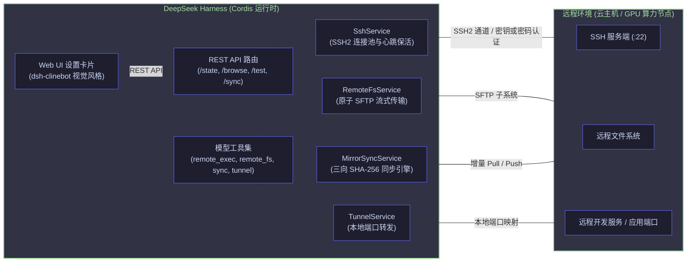

# 📦 @goodandready/dsh-remote-workspace

<div align="center">

<h3>适用于 DeepSeek Harness 的企业级远程工作区插件：SSH、SFTP 文件同步与端口转发</h3>

<p align="center">
  <a href="https://www.npmjs.com/package/@goodandready/dsh-remote-workspace"></a>
  <a href="LICENSE"></a>
  <a href="https://github.com/topics/dsh-plugin"></a>
  <a href="https://nodejs.org"></a>
</p>

<!-- 作者作品展示按钮 -->
<p align="center">
  <a href="https://goodandready.app/"></a>
</p>

<p align="center">
  <a href="README.md"><b>🇬🇧 English</b></a> •
  <a href="README.ru.md"><b>🇷🇺 Русский</b></a> •
  <a href="README.zh.md"><b>🇨🇳 中文说明</b></a>
</p>

<table align="center">
  <tr>
    <td align="center">
      ⭐ <strong>如果您喜欢这个插件，请在 GitHub 上为它点亮 Star</strong> — 这能让我知道插件对您有用，并鼓励我继续开发和维护它。
      <br><br>
      🐛 <strong>如果您发现 Bug 或希望增加功能</strong>，请使用任意语言在 GitHub 上提交 Issue — 我会评估您的建议，并在后续版本中实现有价值的改进。
    </td>
  </tr>
</table>

</div>

---

## ⚡ 概述与解决的核心痛点

在现代软件工程与智能体工作流中，由 **DeepSeek Harness (DSH)** 驱动的 AI Agent 往往需要跨越本地限制，在远程基础设施中开展编码与部署工作，例如高性能 GPU 计算节点、云端虚拟机、预发布环境和容器集群。

若没有 `@goodandready/dsh-remote-workspace`，开发者与 Agent 将面临诸多瓶颈：
1. **本地环境边界**：标准 DSH 的工具与运行环境完全受限于部署 DSH 的本地物理机。
2. **临时脚本脆弱不堪**：使用系统命令封装的 SSH/SCP 缺乏连接池复用机制，在遇到网络延迟波动时易卡死或断连，且重连握手开销极大。
3. **静默覆盖与文件损坏风险**：单纯的文件传输无法感知多端并发修改，且在网络中断时极易留下残缺破损的半成品文件。
4. **服务端口隔离**：访问远程节点上启动的 Web 服务、调试端口或大模型推理接口，往往需要开发者在外部繁琐地配置端口映射。

`@goodandready/dsh-remote-workspace` 将企业级远程工作区能力无缝注入 Cordis 架构：提供基于 SSH2 的高性能连接池、具备原子写入保护的 SFTP、基于 SHA-256 的三向冲突感知同步引擎、动态端口转发隧道，以及参照 `dsh-clinebot` 风格精心打造的 Web UI 设置卡片。

---

## 🏗️ 架构设计



---

## ✨ 核心特性深度解析

### 1. `SshService` — 高性能连接池与双认证支持
- **持久连接池**：按 `host:port:username` 缓存已建立认证的 SSH2 客户端会话，极大降低重复握手延迟。
- **双重认证方式**：
  - **SSH 私钥认证**：支持读取本地私钥文件路径（如 `~/.ssh/id_ed25519`）、直接输入 PEM 格式密钥文本以及解密口令（Passphrase）。
  - **密码认证**：原生支持常规账号密码安全登录。
- **链路诊断探测**：内置 `testConnection` 方法，精确测定毫秒级网络延迟，并自动探测远程主机内核与架构（`uname -srm`）。
- **心跳保活机制**：主动发送 Keep-Alive 探测包，有效防止各类网络防火墙超时断开空闲连接。

### 2. `RemoteFsService` — 原子高可用 SFTP 文件系统
- **原子安全写入**：文件首先上传至独立的临时文件（`.tmp.<timestamp>.<hash>`)，上传完成校验后通过原子重命名完成替换，彻底避免因网络异常产生残缺文件。
- **高性能流式读取**：采用分块流式读取技术，高效传输大文件且不消耗过多内存。
- **完整文件基语**：提供 `stat`、`listDir`、递归创建目录 `mkdir -p` 以及递归删除 `remove`。

### 3. `MirrorSyncService` — 冲突感知的两向/三向镜像同步
- **哈希状态基线**：在 `.dsh-sync-manifest.json` 中完整记录受控文件的 SHA-256 摘要。
- **并发冲突拦截**：精准识别本地与远程自上次同步基线以来的同时变动，并在发生冲突时主动中断操作并输出详细冲突列表，绝不静默覆盖。
- **定向传输模式**：支持 `pull`（远程 → 本地）和 `push`（本地 → 远程），并支持安全强制覆盖（`force`）参数。
- **演练预览 (Dry-Run)**：支持在不产生任何实际磁盘写入的情况下，完整模拟输出变动、新增与删除文件清单。
- **智能忽略规则**：内置对版本控制目录、依赖包及临时构建文件的过滤（`.git`、`node_modules`、`.dsh`、`.worktrees`、`.DS_Store`）。

### 4. `TunnelService` — 深度集成的 SSH 端口转发
- **本地端口转发 (Local Port Forwarding)**：在运行 DSH 的主机上开启本地监听端口，将流量通过加密 SSH 隧道透明转发至远程主机的指定端口（例如访问远程 `127.0.0.1:8080`）。
- **生命周期管控**：支持动态开启、注销并实时查询活跃隧道列表。

### 5. `tools.js` — 专为 AI Agent 设计的模型工具
为 Agent 赋予 4 个精简、正交的系统级能力：
- `remote_exec`：在远程工作区执行 Shell 命令，获取标准输出、错误输出及返回码。
- `remote_fs`：执行远程文件的读、写、状态查询、目录列表、创建与删除。
- `remote_sync`：在本地镜像与远程目录间发起具备冲突感知的同步操作。
- `remote_tunnel`：开启、关闭或枚举 SSH 端口转发隧道。

### 6. `client.js` — 原生 DSH 设置面板
- 深度适配 `settings.plugin.item` 插槽（Key: `dsh-remote-workspace`）。
- **分段式认证切换器**：优雅切换私钥认证与密码认证。
- **远程目录浏览器弹窗**：可视化浏览远程服务器目录树，支持面包屑导航与一键选取。
- **实时连接状态徽章**：可视化展示连通性、网络延迟以及远程操作系统信息。
- **快捷动作触发**：一键发起定向文件同步并监控隧道运行状态。

---

## 📦 快速安装

通过 DSH `web` 配置文件安装：

```bash
dsh plugin --profile web add @goodandready/dsh-remote-workspace
```

或使用标准命令安装：

```bash
dsh plugin add @goodandready/dsh-remote-workspace
```

---

## ⚙️ 配置参数详解

可在 Web UI 的设置卡片中直接配置，或写入 DSH 配置文件（`settings.yaml`）：

```yaml
dsh-remote-workspace:
  activeProfileId: "prod-cloud-gpu"
  profiles:
    - id: "prod-cloud-gpu"
      name: "Cloud GPU VM"
      host: "remote.example.com"
      port: 22
      username: "deploy"
      authType: "key"              # 可选 "key" 或 "password"
      privateKeyPath: "/home/user/.ssh/id_ed25519"
      passphrase: ""
      password: ""
      remoteWorkspace: "/var/www/my-project"
      localMirrorPath: "/home/user/projects/my-project"
```

### 参数定义列表

| 参数名 | 数据类型 | 默认值 | 说明 |
|---|---|---|---|
| `profiles` | `Array<Profile>` | `[]` | 已配置的远程主机与工作区清单。 |
| `activeProfileId` | `string` | `""` | 当前激活使用的远程主机配置 ID。 |
| `profile.id` | `string` | `""` | 主机配置的唯一标识符。 |
| `profile.name` | `string` | `""` | 在 UI 中显示的主机友好名称。 |
| `profile.host` | `string` | `""` | 远程服务器的域名或 IP 地址。 |
| `profile.port` | `number` | `22` | SSH 服务端口。 |
| `profile.username` | `string` | `""` | 登录用户名。 |
| `profile.authType` | `string` | `"key"` | 认证方式：`"key"`（私钥）或 `"password"`（密码）。 |
| `profile.privateKeyPath`| `string` | `""` | 本地 OpenSSH 私钥文件的绝对路径。 |
| `profile.privateKey` | `string` | `""` | PEM 格式私钥文本内容（与路径二选一）。 |
| `profile.passphrase` | `string` | `""` | 加密私钥的解密口令。 |
| `profile.password` | `string` | `""` | 密码认证模式下的登录密码。 |
| `profile.remoteWorkspace` | `string` | `""` | 远程服务器上的项目工作区根目录。 |
| `profile.localMirrorPath` | `string` | `""` | 对应远程项目的本地镜像工作目录。 |

---

## 🔌 Agent 模型工具接口规范

### `remote_exec`
在当前激活的远程主机上执行 Shell 命令。
- **输入参数**：
  - `command` (`string`，必填)：待执行的命令文本。
  - `cwd` (`string`，选填)：远程执行工作目录（默认取当前配置的 `remoteWorkspace`）。
- **返回数据**：`{ exitCode: number, stdout: string, stderr: string }`

### `remote_fs`
通过 SFTP 执行远程文件系统操作。
- **输入参数**：
  - `action` (`string`，必填)：可选 `"read"`、`"write"`、`"stat"`、`"list"`、`"mkdir"`、`"remove"`。
  - `path` (`string`，必填)：目标远程路径。
  - `content` (`string`，写入时必填)：写入文件的内容。
  - `recursive` (`boolean`，删除时选填)：是否递归删除目录。
- **返回数据**：根据不同操作返回对应数据（`{ content }`、`{ stat }`、`{ entries }`、`{ ok: true }`）。

### `remote_sync`
在本地镜像与远程服务器之间执行具备冲突感知的同步。
- **输入参数**：
  - `direction` (`string`，必填)：`"pull"`（远程拉取至本地）或 `"push"`（本地推送至远程）。
  - `force` (`boolean`，选填)：若为 true，在检测到冲突时仍强制覆盖。
  - `dryRun` (`boolean`，选填)：若为 true，仅演练并返回变动清单，不实际修改磁盘。
- **返回数据**：包含处理文件清单、统计结果及冲突信息的汇总对象。

### `remote_tunnel`
管理 SSH 本地端口转发隧道。
- **输入参数**：
  - `action` (`string`，必填)：`"start"`、`"stop"` 或 `"list"`。
  - `localPort` (`number`，启动时必填)：本地绑定的监听端口。
  - `remotePort` (`number`，启动时必填)：远程目标转发端口。
  - `tunnelId` (`string`，停止时必填)：需要关闭的隧道 ID。
- **返回数据**：`{ tunnelId, localPort, remotePort }` 或隧道清单 `{ tunnels: [...] }`。

---

## 🌐 HTTP API 接口列表

所有 REST 路由均挂载在 `/dsh-remote-workspace` 命名空间下：

| 请求方法 | 路由路径 | 功能说明 | 请求体格式 |
|---|---|---|---|
| `GET` | `/dsh-remote-workspace/state` | 获取所有配置、当前激活 ID 与活跃隧道列表。 | — |
| `POST` | `/dsh-remote-workspace/profiles/save` | 创建或更新主机配置。 | 主机配置 JSON |
| `POST` | `/dsh-remote-workspace/profiles/delete` | 删除指定主机配置。 | `{ id: string }` |
| `POST` | `/dsh-remote-workspace/profiles/active` | 切换当前激活的主机。 | `{ id: string }` |
| `POST` | `/dsh-remote-workspace/test` | 测试 SSH 连通性、延迟与系统信息。 | 主机配置 JSON |
| `POST` | `/dsh-remote-workspace/browse` | 获取指定远程路径下的子目录列表（供选择器使用）。 | `{ profile: object, path: string }` |
| `POST` | `/dsh-remote-workspace/sync` | 发起手动目录镜像同步。 | `{ direction: "pull" \| "push", dryRun?: boolean, force?: boolean }` |

---

## 📄 开源许可证

MIT © [GooDAnDReaDY](https://github.com/GooDAnDReaDY)
